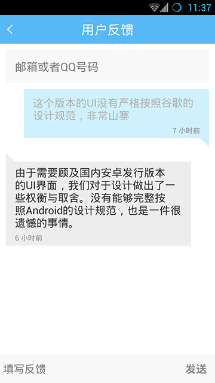

# leancloud-feedback-Android

LeanCloud Feedback 模块是 [LeanCloud](https://leancloud.cn) 开源的一个用户反馈组件，反馈内容存储在 LeanCloud 云端，开发者可以通过 LeanCloud 提供的统计分析客户端 [LeanAnalytics](https://itunes.apple.com/IE/app/id854896336) 来实时查看和回复用户反馈。

用户反馈界面如下：





## 代码地址
现在我们已经将所有的 SDK 代码开源了，为了便于管理和维护，用户反馈的最新代码被转移到了 [repository: Android-SDK-All](https://github.com/leancloud/android-sdk-all)

## 如何贡献
你可以通过提 issue 或者发 pull request 的方式，来贡献代码。开源世界因你我参与而更加美好。

## 核心概念
### FeedbackReply
FeedbackReply 代表了反馈系统中间，用户或者开发者的每一次回复。不同的类型可以通过 ReplyType 属性来指定。FeedbackReply 内部主要记录有如下信息：

* content，反馈的文本内容
* replyType，类型标识，表明是用户提交的，还是开发者回复的
* attachment，反馈对应的附件信息

### FeedbackThread
代表了用户与开发者的整个交流过程，与用户一一对应。一个用户只有一个 FeedbackThread，一个 FeedbackThread 内含有多个 FeedbackReply。FeedbackThread 内部主要记录有如下信息：

* contact，用户联系方式
* content，用户第一次反馈的文本
* status，当前状态：open 还是 close
* remarks，预留字段，开发者可以用来标记的一些其他信息


## 在我的项目中如何使用这一组件
为了调试方便，我们推荐大家直接把本项目的源代码加入自己工程来使用（在 Android Studio 中为你的项目 import module 即可）。

### 进入反馈界面

要能够使用反馈组件，首先需要联网；要能够发送截图，还需要应用可以访问外部存储，所以需要你在 AndroidManifest.xml 配置文件中申请如下权限：

```
   <uses-permission android:name="android.permission.INTERNET" />
   <uses-permission android:name="android.permission.ACCESS_NETWORK_STATE" />
   <uses-permission android:name="android.permission.WRITE_EXTERNAL_STORAGE"/>
```

要使用默认的反馈界面，还需要在 AndroidManifest.xml 配置文件中加入如下 activity 声明：

```
   <activity
       android:name="com.leancloud.modules.feedback.ThreadActivity" >
   </activity>
```

要进入默认的反馈界面，开发者只需要使用如下两行代码即可：

```
    FeedbackAgent agent = new FeedbackAgent(MainActivity.this);
    agent.startDefaultThreadActivity();
```

### 新回复通知
如果您需要在用户打开App时，通知用户新的反馈回复，只需要在您的入口Activity的OnCreate方法中添加:

```
agent.sync();
```


*注：注意: 此功能使用了Android Support Library, 所以请添加最新版本 android-support-v4.jar 到工程的libs目录下*。

当用户收到开发者的新回复时，就会产生一个新的消息通知。如果您需要改变通知的图标，请替换res下`avoscloud_feedback_notification.png`文件即可。

如果您不需要通知栏通知，又迫切需要在用户在打开App时同步反馈信息，您可以调用

```
agent.getDefaultThread().sync(SyncCallback);
```

这里的SyncCallback是一个异步回调，其中的方法会在同步请求成功以后被调用。


### 高级定制指南

如果我们的反馈组件UI无法满足您的需求，您可以通过Feedback SDK提供的数据模型结合自定义UI来满足您的需求。更多的信息您可以参考我们的实现的 ThreadActivity。

## 其他问题
### 我要增加额外的数据，该怎么做？
可以扩展 Comment 的属性值，从而保存更多的内容。譬如允许用户截图来反馈问题的话，可以在应用中先把图片存储到 LeanCloud 云端（使用 AVFile），然后把 AVFile 的 url 保存到 Comment。

